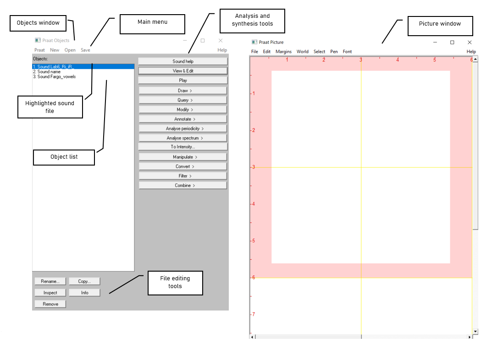

### Goal of Lab 1:
The goal of this first lab is to explore some of the basic features of PRAAT (www.praat.org), which we will be using for speech analysis throughout the term. You will learn to make recordings, bring up visual displays of these recordings (waveforms and spectrograms), segment and label various components of these recordings, and export the visual displays into a word document. The skills you learn today will be useful for your lab work throughout the remainder of this course and beyond…

1. Open Praat: double click on the following icon:

 

2. Get to know the Praat layout

>TIP: The tools you see in the Analysis and Synthesis Tool Panel (see Figure 1.2 above) are specific to the highlighted object(s) in the list. For example, the tools that are listed for a sound object are different from that for a Textgrid object. When you first open Praat, there will be nothing in your object list. As a result, nothing will show up in your Analysis and Synthesis Tool Panel.

 

3. Record the sentence: “My name is [first-name] [last-name]” 

In the main menu of the Objects window (see Figure 1.2):

* Click New > Record mono Sound (sampling rate: 44 100 Hz) (Figure 1.3)
* Make sure the volume bar is fluctuating as you record – if it isn’t, you’re not recording or you’re not speaking loudly enough. You may need to find the correct microphone under “Input source”.
* Watch out for clipping (Figure 1.4): if your recording level is too high and you go into the red on the volume bar, you’ll end up with what is called a “clipped” signal – this is very bad for speech analysis!
* Give the recording a name (in the box above “Save to list”)
* Click Save to list

 

4.	Open the sound file in the Edit window:
* In the Objects window (see Figure 1.2), highlight the sound file you’ve just recorded.
* Click **View & Edit** on the “Analysis and synthesis tools” panel (see Figure 1.2).

 

When you first open a sound file in the View & Edit window, it may seem a bit of a mess. Depending on the default settings in the version of Praat you are using, you may see blue vertical lines in the waveform, and lines of red dots and a blue line in the spectrogram (see Figure 1.5). If you don’t need these displays for your current purposes (you don’t for this lab!), you can tidy up the visual display by doing the following: 

* In the menu of the View & Edit window:
  + **Pulses > Show pulses** (click on this to unselect it)
  + **Formant > Show formants** (click on this to unselect it)
  + **Pitch > Show pitch** (click on this to unselect it)

 

Two things are being displayed now in the Edit window: **the waveform** on the upper level and **the spectrogram** on the lower level.

> TIP: Here are some common manipulations you will find useful:
 
> *Selecting a portion of the sound file and measure the duration of the portion*
* To select a portion of the sound file, place the cursor on the starting point on the waveform or spectrogram and drag the mouse over the portion you are interested in.
* The number in black at the top and bottom of the display indicates the duration of the selection. The two red numbers on each side of the selection (on the top only) indicate the starting and ending time of the selection (see Figure 1.6).
 
> *Zooming into a portion of the sound file*
* To zoom into a specific portion of the sound file, select it first and click “sel” in the zoom options panel (see Figure 1.6).
* You can also use the “in” and “out” buttons in the zoom options panel to zoom in or zoom out within the sound file. This will zoom the file around the center point of the window display, regardless of where your cursor is.
 
> *Listening to a sound file*
* In the View & Edit Window, you can listen to the sound file or a portion thereof by clicking on one of the panels at the bottom of the display (Figure 1.6).

 

5. Extract [first-name] [last-name]; #I made some changes to fit the new Praat version here - Taylor 
* Select the portion that corresponds only to your first and last name (see Figure 1.6)
* **Sound > "Extract sounds to object window" > Extract selected sound (time from zero)** (The extracted selection will show up as an entry (‘sound untitled’) in the Praat objects window)
* Close View & Edit window

 

6. Rename the extracted file ('sound untitled' in the Praat objects window)
* In the Objects window, highlight 'sound untitled'
* Click **Rename** below the object list

 

7. Save the new sound file on the desktop:
* Highlight the file in the object list
* **Save > Save as WAV file…** (this is the most widely acceptable extension)
* Select the desktop as the save-to location

 

8. Create a **textgrid**: textgrids let you label or annotate the spectrogram (and sound file) – they are particularly helpful for acoustic analysis, to keep track of where you’ve taken measurements, etc.
* In the Praat Objects window, highlight the newly renamed file (see step 6)
* **Annotate > To TextGrid…** (see Figure 1.7)
* Create two tiers (this will be enough for our purposes): All Tier names: **word segment**
  + This creates 2 tiers, one with the name of ‘word’ and the other with the name of ‘segment’. Ignore the second line in the TextGrid naming window, “Which of these are point tiers”. This is irrelevant at the present stage.
  
 

9. Open the sound file and textgrid together (see Figure 1.8): In order to segment and/or label a sound file, you have to open the sound file TOGETHER with its textgrid file.
* Hold down Ctrl (or Command on a Mac) and click on each file to highlight them both
* **View & Edit**

 

![Figure 1.8 Opening a textgrid file with its corresponding sound file] (.\Images\Figure1_8.png)

 

In your display you should now see the waveform (top), the spectrogram (middle) and the textgrid (bottom) corresponding to your sound file (see Figure 1.9). We will talk about waveforms and spectrograms in detail later on.

 

10. Segment the file (see Figure 1.9): In the sound file, identify your first name and last name. Use the following steps to segment each:
* To find your first and last name on the spectrogram, listen to the sound file and look at the spectrogram – these should give you hints as to where your first name ends and your second name and starts. It may help to zoom into small chunks of the sound file and listen to those.
* Place the cursor at the beginning of the name on the spectrogram/waveform (not on the Textgrid tier). A boundary line will show up.
* Click in the little circle at the top of the word tier in the Textgrid to create a boundary (Figure 1.9).

>TIP: To remove a boundary you have made, do the following:
* Highlight the boundary by going to **Boundary > Remove** or click **Alt + Backspace**
* Move a boundary by clicking on the boundary to highlight it (should go red as a result) and drag it to the desired location
# Changed the wording here to make it look and sound better. Also thought it would be better as a tip! - Taylor

 

11. Label the intervals (see FIgure 1.9)
* Select/highlight the target interval by clicking between two boundaries, the selected interval should go yellow
* To input or change the text in an interval, edit in the Textbox above the spectrogram (See Figure 1.9).
* Give each interval you create a name ([first name] or [last name])

  

12.	Follow steps (10) and (11) to segment your [first name + last name] into segments.

 

> TIP: To use phonetic symbols in your segment tiers:
* In the TextGrid editing window, go to **Help > Phonetic symbols**
* From here, you can see what keystrokes you need to create special fonts (using them is not recommended as they end up looking a bit wonky...)

 

13. Save your textgrid onto the desktop:
* **File > Save TextGrid as textfile...**

 

14. Export your labeled waveform and spectrogram to Word (see Figure 1.10):
* Maximize the Edit window: click on the little square at the top right of your Edit window
* Hit **PrtSc** (“Print Screen”) or **Command-shift-3** on your Windows or Mac keyboard respectively. Nothing will happen on your screen at this point
* Open Word, and provide a prose introduction to the image you are about to paste in: e.g. “Figure 1 is a waveform and spectrogram of my name”
* Hit **Ctrl + V** to paste the Praat image into your word document

 

15. Save the file: you must upload this to eClass.

 

If you complete all of these steps, you should end up with a word file with an image of the labeled waveform/spectrogram corresponding to your name, as in Fig. 1.10. You can save this file, and your Praat files (sound and textgrid) by e-mailing them to yourself or copying them onto a flash drive (memory stick).

  

Your lab report should include one Figure, corresponding to the segmented and labeled spectrogram/waveform of your name. In addition, please answer the following questions:
 
**Q1:** How can you tell where one word ends and another word begins?
 
**Q2:** Do you notice any patterns in terms of how different sounds look visually, on either the waveform or the spectrogram?
 
a. Which sounds have the highest amplitude and how can you tell?
 
b. How do sounds of different sonority (e.g. stop vs. fricative) look on the spectrogram?

     

 Disclaimer: The original lab materials on which this lab is based was put together in 2015 (updated 2019) by Sonya Bird, Qian Wang, Sky Onosson, and Allison Benner for the LING 380 Acoustic Phonetics course at the University of Victoria. Their materials are released under a Creative Commons license (CC BY-NC-SA 4.0) which allows for non-commercial use as well as copying and distribution and the creation of derivative works for non-commercial purposes. Thomas Kettig has modified these materials as needed for the York University LING 4220 Acoustic Phonetics course.

