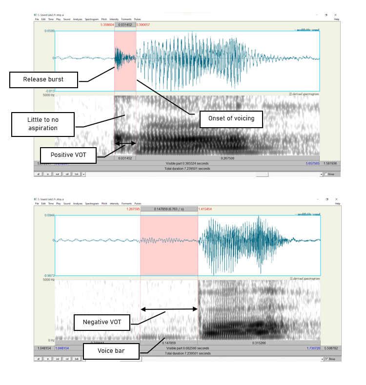
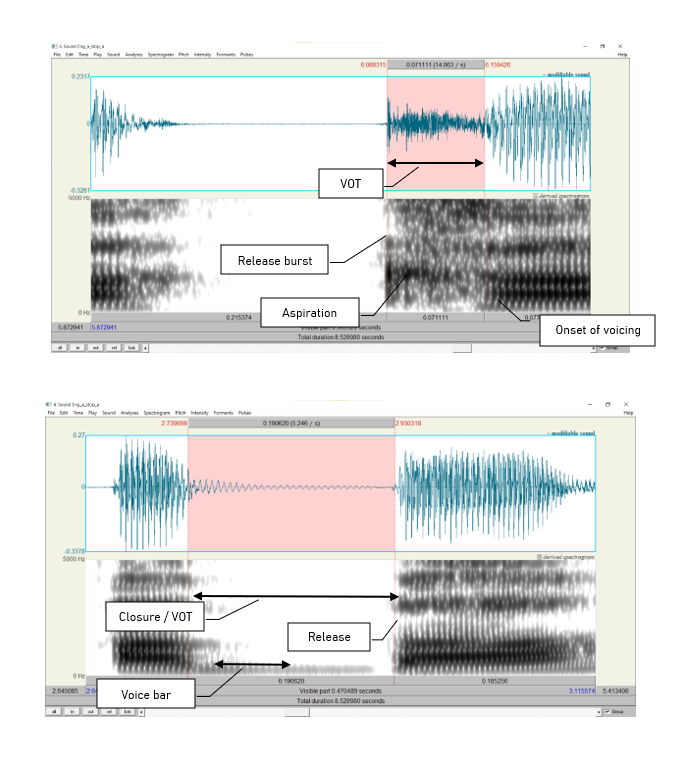

*** 

### __Goal of Lab 2:__
<h4> One of the most common acoustic features that is measured and manipulated in speech research is voicing in stop consonants (in particular voice onset time), so this is a good place to start. In this lab, we are going to explore the acoustic correlates of different stop consonants in terms of two parameters: _voicing_ and _place of articulation_. </h4>

***

##### __RECORDING__

Generate the following sound files, containing the sound sequences listed.  

|    _File name_       |   _Sounds to record_              |
|:--------------------:|:---------------------------------:|
|Lab2_Eng_stop_a.wav   |  pa, ba, ta, da, ka, ga           |
|Lab2_Eng_a_stop_a.wav |  apa, aba, ata, ada, aka, aga     |
|Lab2_Eng_a_stop.wave  |  lap, lab, bat, bad, rack, rag    |

 
If you are a fluent French speaker, also generate the following sound files. Otherwise, you can go to eClass and download the zip file __Lab2_SoundFiles__, which contains these files.

|    _File name_      |   _Sounds to record_                |
|:-------------------:|:-----------------------------------:|
|Lab2_Fr_stop_a.wav   |   pa, ba, ta, da, ka, ga            |
|Lab2_Fr_a_stop_a.wav |   apa, aba, ata, ada, aka, aga      |
|Lab2_Fr_a_stop.wav   |   nappe, nab, latte, lad, sac, vague|

 
Three important acoustic correlates of voicing in English stops are:

* The voice bar
* VOT
* The duration of the preceding vowel

For each of the stops in the file, take the three measurements according to the instructions below and fill out Table 2.1, Table 2.2 and Table 2.3 accordingly. Answer the related questions by comparing your measurements across stops.

***

##### __INSTRUCTIONS__

1. Open the following sound files in Praat: **Eng_stop_a.wav** and **Fr_stop_a.wav**. Measure the VOT of each stop (see Figure 2.1) and fill in Table 2.1. Compare voiced/voiceless counterparts (p/b, t/d, k/g):

  +	Zoom in so that you can clearly see the transition between the stop and vowel
  + Measure the time between the end of the stop closure ( = the beginning of the release burst) and the onset of voicing ( = the onset of _regular_ pitch pulses in the waveform). This is the __voice onset time__, or VOT.
    + If the onset of voicing <u> follows </u> the release of the stop clouse, then VOT is calculated as _positive_; stops with positive VOT are termed _voiceless_.
      + VOTs between 0-20ms correspond to __voiceless unaspirated stops__
      + VOTS above 20ms correspond to __voiceless aspirated stops__
    + If the onset of voicing <u> precedes </u> the release of the stop closure, then VOT is calculated as _negative_; stops with negative VOT are termed __prevoiced__ or more generally, __voiced__. (See bottom of Figure 1.2)
    

 

> __TIP:__
Praat reports time values in seconds, but in phonetic analysis we report in milliseconds, so the values need to be converted. Once you have converted to milliseconds, you do not need to report any decimal places.

 

2. Open the following sound files in Praat: **Eng_a_stop_a.wav** and **Fr_a_stop_a.wav**. Note down the presence vs. absence of the voice bar (see Figure 2.2) during the stop closure of each consonant in Table 2.2 in the report.

 

3. Open the following sound files in Praat: **Eng_a_stop.wav** and **Fr_a_stop.wav**. Measure the duration of the vowel preceding each stop, and fill in Table 2.3 in the report. Compare vowel durations in the voiced vs. voiceless series.

 

> __TIP:__
In order to measure the duration of the vowel, you will need to identify the section of the spectrogram which makes up the vowel. One common means of doing so is to measure where there are clearly visible vowel formants. Whatever method you do use, the most important thing is to be consistent and use the same method for **all** your measurements.

 

***

***
 

 <h4> __LAB 2 REPORT__ </h4> 
 

 _Table 2.1 VOT_ 

|                              |  p   |   b  |   t  |   d  |   k  |   g  |
|:-----------------------------|:----:|:----:|:----:|:----:|:----:|:----:|
|English VOT (ms) (Eng_stop_a) |      |      |      |      |      |      |
|French VOT (ms) (Fr_stop_a)   |      |      |      |      |      |      |

 

__Q1:__ How does VOT differ in voiced vs. voiceless stops and what explanation can you come up with for this?

 

 _Table 2.2 Voice bar_ 

|                                     |                       |  p   |   b  |   t  |   d  |   k  |   g  |
|:------------------------------------|:----------------------|:----:|:----:|:----:|:----:|:----:|:----:|
|English voice bar (ms) (Eng_a_stop_a)|Is it there?           |      |      |      |      |      |      |
|                                     |How long does it last? |      |      |      |      |      |      |
|French voice bar (ms) (Fr_a_stop_a)  |Is it there?           |      |      |      |      |      |      |
|                                     |How long does it last? |      |      |      |      |      |      |

 

__Q2:__ If the voice bar is present at all, does it last through the duration of the closure? Why do you think it might go away?

__Q3:__ What differences (if any) do you observe in the voice bar between English and French?

 

 _Table 2.3 Preceding V duration_ 

|                                               |  p   |   b  |   t  |   d  |   k  |   g  |
|:----------------------------------------------|:----:|:----:|:----:|:----:|:----:|:----:|
|English preceding V duration (ms) (Eng_a_stop) |      |      |      |      |      |      |
|French preceding V duration (ms) (Eng_a_stop)  |      |      |      |      |      |      |

 

__Q4:__ How does the duration of the preceding vowel differ depending on the voicing of the following consonant?

__Q5:__ What differences (if any) do you observe in the preceding vowel duration between English and French?

__Q6:__ Summarizing what you’ve seen in this lab, what are the possible acoustic correlates of the phonemic voicing (voiced vs. voiceless) contrast across languages?

 

 <h4> __REFERENCES__ </h4> 
 

__Q7:__ Provide a reference and very brief summary of one academic paper that uses the methods covered in this lab.

***

 Disclaimer: The original lab materials on which this lab is based was put together in 2015 (updated 2019) by Sonya Bird, Qian Wang, Sky Onosson, and Allison Benner for the LING 380 Acoustic Phonetics course at the University of Victoria. Their materials are released under a Creative Commons license (CC BY-NC-SA 4.0) which allows for non-commercial use as well as copying and distribution and the creation of derivative works for non-commercial purposes. Thomas Kettig (with assistance from Taylor Potter) has modified these materials as needed for the York University LING 4220 Acoustic Phonetics course.

 