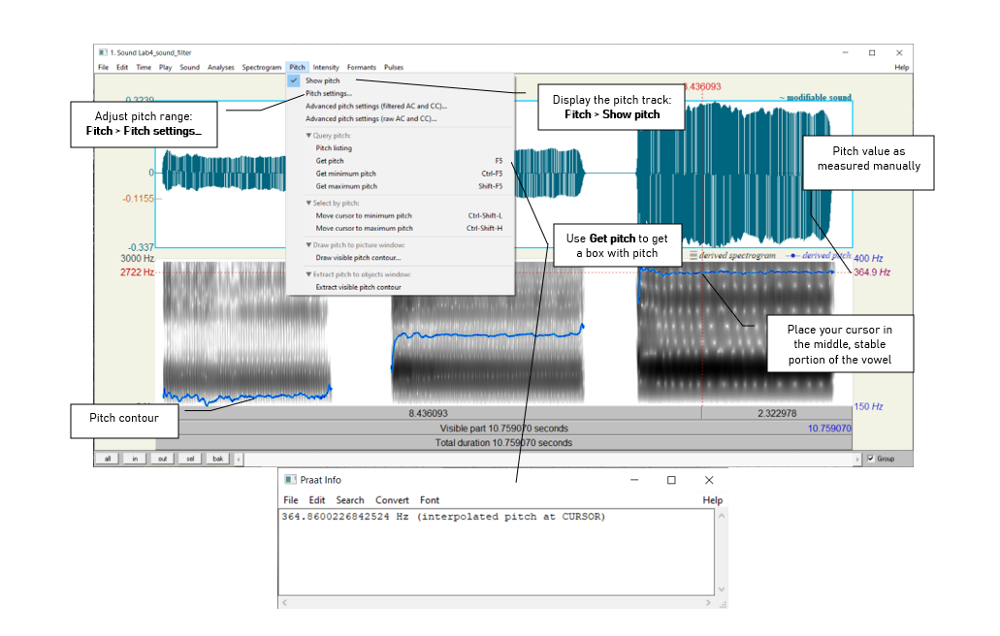
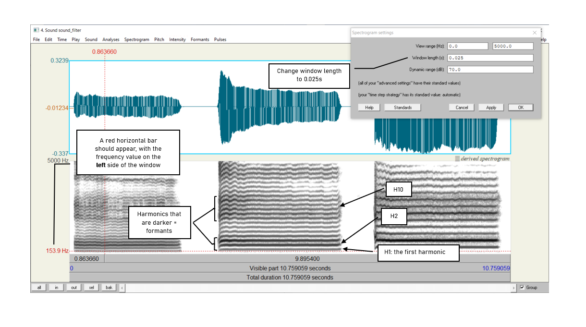
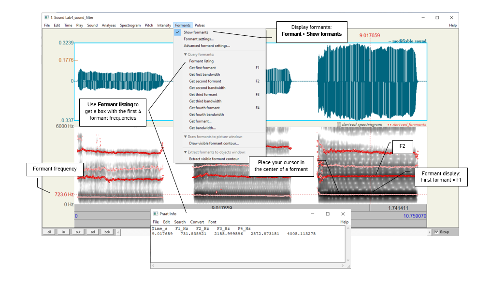

***

### __Goal of Lab 4:__
<h4> The goal of this lab is to explore the relationships between _fundamental frequency, harmonics_, and _formants_, as explained by the Source-Filter model of speech. Understanding these relationships is crucial to understanding the properties of the complex wave that is associated with the speech signal.</h4>

***

#### __RECORDING__

Generate a single sound file, "Lab4_SourceFilter.wav", containing the vowel [ɛ] produced at three different pitches: low, mid, high – try to get the biggest range in pitch you can (if you can’t remember how to record yourself, refer to Lab 1).

***
#### __INSTRUCTIONS__
##### __SECTION I. FUNDAMENTAL FREQUENCY (F~0~) OR PITCH__
 

1. Measure the fundamental frequency (pitch) in the middle of each [ɛ], using the three techniques described below, and fill out Table 4.1.

<!-- > __TIP:__ -->
<!-- For the purposes of this lab, you will have to change the "longest analysis" setting as follows: -->
<!-- > -->
<!-- > * Go to __Analyses > Show analyses...__ -->
<!-- * Change <u> longest analyses (s) </u> to 12.0s -->
<!-- > -->
<!-- > Ensure that you change this setting back once the lab is completed! This can be done by clicking 'Standards' in the same __Show analyses__ window. -->
<!--   -->

<u> Three ways to measure fundamental frequency: </u>

a. By displaying the pitch track and having Praat measure the pitch automatically (see Figure 4.1; this is the technique you used in Lab 3):

* Display the pitch track: __Pitch > Show pitch__
*	Place your cursor in the middle, stable portion of the vowel.
*	Go to __Pitch > Get pitch__: a box will appear with the pitch value in it.

b. By displaying the pitch track and measuring pitch manually (see Figure 4.1): 

* Display the pitch track: __Pitch > Show pitch__
* Click on the blue pitch track in the middle of the vowel
*	A red horizontal bar should appear, with the pitch value (in dark blue) on the right side of the window.

 

>__TIP:__
The fundamental frequency value is always displayed on the _right_ side of the window in dark blue; formant frequencies are displayed on the _left_ side in red – be careful not to get these two confused!

 

 

c. By looking at the waveform (top of the display) (see Figure 4.2):

*	Zoom in to a small piece of the waveform in the middle of the vowel and measure the period by highlighting <u> one complete cycle, going from zero-crossing to zero-crossing </u>, and noting the time associated with it (in the panel above the waveform)
*	To get the frequency ( __f__ ) from the period ( __T__ ): __f =1/T__

 

>__TIP:__
You can get Praat to place the cursor at the nearest zero-crossing by using the hotkey __Ctrl-0__ (zero), or __Command-0__ on a Mac. Additionally, if you highlight a section of a waveform, the hotkeys __Ctrl/Command-__, and __Command-__. will move the left and right edges of the selection, respectively, to the closest zero-crossing.
>
> If you zoom in enough, the panel above the waveform will include both the period and the frequency (in parentheses), so you don’t have to do any calculations.

 

 

##### __SECTION II. HARMONICS__

When our vocal folds vibrate, the result is a complex wave, consisting of the fundamental frequency (which you just measured) plus other higher frequencies, called __harmonics__. To see these, we need to look at a __narrow-band__ spectrogram, which is more precise along the frequency domain than the default __wide-band__ spectrogram.

 

2. Display a narrow-band spectrogram:

* Go to: __Spectrogram > Spectrogram settings...__ (see Figure 4.3)
* Change the window length to <u>0.025s</u> (see Figure 4.3)  
  (The default window length is <u>0.005s</u>, which displays a wide-band spectrogram)
  
 

NOTE: the narrow-band and wide-band spectrograms illustrate the time/frequency trade-off. A spectrogram can have very high resolution in frequency (narrow-band) or in time (wide-band), but not in both!

 

 

3. Looking at each [ɛ], notice the grey horizontal bands: these correspond to harmonics (see Figure 4.3). For each [ɛ] that you recorded, measure the frequency of the first 3 harmonics (H1-H3), plus of the 10th harmonic (H10). Use Table 4.2 to note down your measurements.

* Click on the centre (horizontally) of each harmonic, in the centre (vertically) of each [ɛ]
* A red horizontal bar should appear, with the frequency value on the left side of the window, in red.

 

##### __SECTION III. FORMANTS__

Looking at the narrow-band spectrogram, you should notice that some harmonics are darker than others (see Figure 4.3). Darkness corresponds to loudness, i.e. the darkest harmonics are the ones that are the most amplified. These amplified harmonics form the FORMANTS that are characteristic of sonorant speech sounds.

 

4. Now, go back to the wide-band spectrogram:

* Go to: __Spectrogram > Spectrogram settings...__
* Change the window length back to <u>0.005 s</u> (the default)

 

You will see that the formants appear on the wide-band spectrogram as thich dark bands.

 

5. Measure the first and second formants (F1 and F2) in the middle of each [ɛ] using the three techniques outlined below and note down your measurements in Table 4.3.

 

<u>Three ways to measure formants: </u>

a. By displaying the formants (red dots) and having Praat measure the frequency of each formant automatically (see Figure 4.4):

* Display the formant track: __Formant > Show formants__
* Place your cursor in the middle, stable portion of the vowel
* Go to __Formant > Formant listing__: a box will appear providing the time point at which the measurement was taken, and values for the first four formants at that time (F1 and F2 are the important ones now).

b. By displaying the formants and measuring the frequency of each one manually: 

* Display the pitch track: __Formant > Show formants__
*	Place your cursor in the center of each formant, in the middle of the vowel
*	A red horizontal bar should appear, with the frequency value on the left side of the window, in red (see Figure 4.4).

c. By measuring the frequency without displaying Praat’s formants – this is sometimes easiest if Praat’s formant tracking goes wonky.

*	Get rid of Praat’s formant tracking: Formant > Show formants (unclick)
* Place your cursor in the center of each formant, in the middle of the vowel
*	A red horizontal bar should appear, with the frequency value on the left side of the window, in red.

 

 

##### __SECTION IV. THE RELATIONSHIP BETWEEN HARMONICS AND FORMANTS__

The relationship between the harmonics and the formants is captured in the _source-filter model_ of speech production. In this last section of the lab, think about what the source and filter might be in this model.

6. Get rid of the pitch contour: __Pitch > Show pitch__ (unclick)
 

7. What is the ordinal number of the harmonic (H2, H5, H8, etc.) that is at the _centre_ of the first formant, for each [ɛ]? Use Table 4.4 to note down your answer.

 

***

***
 

 <h4> __LAB 4 REPORT__ </h4> 
 

 <h4> __SECTION I. FUNDAMENTAL FREQUENCY (F~0~) OR PITCH__ </h4> 
 

 _Table 4.1 Fundamental frequency measurements_ 

|_Recording_        | Pitch contour (automatic) | Pitch contour (manual) | Waveform (one cycle) |
|:------------------|:--------------------------|:-----------------------|:---------------------|
|[ɛ] low pitch      |                           |                        |                      |
|[ɛ] mid pitch      |                           |                        |                      |
|[ɛ] high pitch     |                           |                        |                      |

 

__Q1:__ Which method do you prefer and why?

 

 <h4> __SECTION II. HARMONICS__ </h4> 
 

 _Table 4.2 Harmonic measurements_ 

|[ɛ] pitch          | H1 | H2 | H3 | H10|
|:-----------------:|:--:|:--:|:--:|:--:|
|Low                |    |    |    |    |
|Mid                |    |    |    |    |                     
|High               |    |    |    |    |   

 

__Q2:__ Compare the frequency of H1 with the fundamental frequencies measured in 1 above. Based on this comparison, what does the first harmonic (H1) correspond to?

>__TIP:__
If you have a very low voice, the first dark line you see may be H2, instead of H1. Ask your instructor if in doubt...

__Q3:__ What is the relationship between the first and subsequent harmonics? (The relationship should be the same across [ɛ]s.)

>__TIP:__
Keep in mind there will be measurement error here, so various relationships may not be as clear as they would be in an ideal world…

 

 <h4> __SECTION III. FORMANTS__ </h4> 

 _Table 4.3 Formant measurements_ 

|_Recording_     |With formant tracking (automatic)|With formant tracking (manual)|Without formant tracking (manual)|
|:---------------|:--------------------------------|:-----------------------------|:--------------------------------|
|[ɛ] low pitch   |F1:                              |                              |                                 |
|                |F2:                              |                              |                                 |
|[ɛ] mid pitch   |F1:                              |                              |                                 |
|                |F2:                              |                              |                                 |
|[ɛ] high pitch  |F1:                              |                              |                                 |
|                |F2:                              |                              |                                 |

 

__Q4:__ Which method do you prefer and why?

__Q5:__ Would you say the formant frequencies are the same or different across [ɛ]s? (Be sure to take measurement error into account when answering this question.)

 

 <h4> __SECTION IV. THE RELATIONSHIP BETWEEN HARMONICS AND FORMANTS__ </h4> 

 _Table 4.4 Harmonics and formants_ 

|_Recording_        |Number of the harmonic corresponding to first dark band in narrow-band spectrogram (e.g. H1, H4) |
|:------------------|:------------------------------------------------------------------------------------------------|
|[ɛ] low pitch      |                                                                                                 |
|[ɛ] mid pitch      |                                                                                                 |
|[ɛ] high pitch     |                                                                                                 |

 
__Q6:__ Does this harmonic have the same number across [ɛ]s? Why or why not?

__Q7:__ What explanation is there for the pattern observed in Table 4.3 and Table 4.4: why would the harmonic number be different across [ɛ]s (Table 4.4), but the frequency of this harmonic (approximately = F1) be (approximately) the same across [ɛ]s (Table 4.3)?

 

 <h4> __REFERNCES__ </h4> 

__Q8:__ Provide a reference and very brief summary of one academic paper that uses the methods covered in this lab.

***

 Disclaimer: The original lab materials on which this lab is based was put together in 2015 (updated 2019) by Sonya Bird, Qian Wang, Sky Onosson, and Allison Benner for the LING 380 Acoustic Phonetics course at the University of Victoria. Their materials are released under a Creative Commons license (CC BY-NC-SA 4.0) which allows for non-commercial use as well as copying and distribution and the creation of derivative works for non-commercial purposes. Thomas Kettig (with assistance from Taylor Potter) has modified these materials as needed for the York University LING 4220 Acoustic Phonetics course.

 
