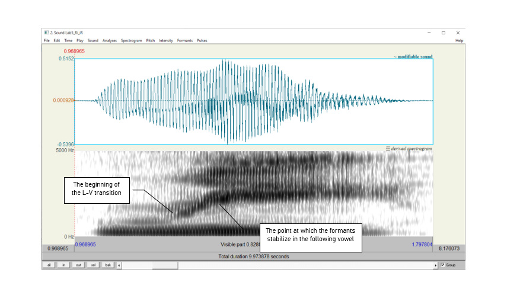
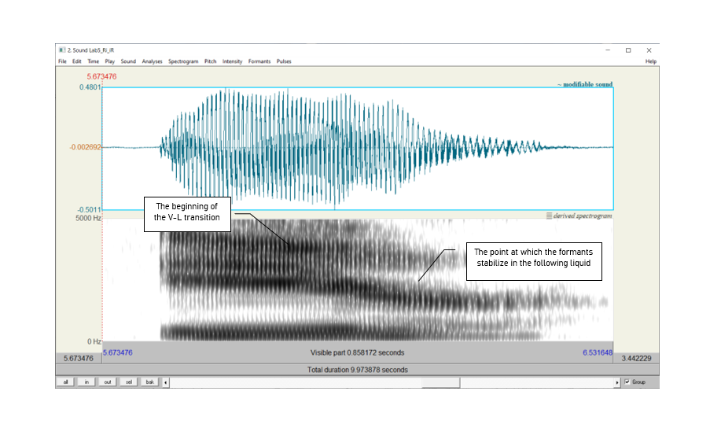

***

### __Goal of Lab 5:__
<h4> Sonorants are:

* similar to vowels in that they have formants
* different from vowels in that they are generally lower amplitude (and behave as consonants phonologically)

In this lab, we are going to explore the acoustic correlates of two types of sonorants: _glides_ [w j] and _liquids_ [ɹ l]. </h4>

***

#### __RECORDING__

Go to eClass and download the zip file "Lab5_Soundfiles", containing the following files. Note, you can also generate these yourself; I have done it for you here to make sure that the sound files are clear enough for taking measurements.

| _File name_     | _Sounds to record_  |
|:---------------:|:-------------------:|
|Lab5_Wi_Ju.wav   |  wi, ju             |
|Lab5_Ri_Ri.wav   |  ɹi, li, iɹ, il     |

 

***

#### __INSTRUCTIONS__
##### __SECTION I. GLIDES__

 

1. Open the file __Lab5_Wi_Ju.wav__. Follow the instructions below and fill in Table 5.1 on the acoustic correlates of different glides.

<u> A. Formants </u>

* In Table 5.1, note down the frequency of F1, F2 and F3 for each glide, as measured around the midpoint of the glide. The midpoint of __[w]__ should be at about __1.23s__ and the midpoint of __[j]__ should be at about __3.25s__.

 

<u> B. Formant transitions </u>

* In Table 5.1, either draw stylized lines to indicate the F1, F2 and F3 contours throughout each Glide-Vowel sequence, or briefly describe in prose the path of the contours that you observe.

 

------

##### __SECTION II. LIQUIDS__

 

2. Open the file Lab5_Ri_iR.wav. Follow the instructions below and fill in Table 5.2 on the acoustic correlates of different liquids.

 

<u> A. Formants </u>

Use only the coda [ɹ] and [l] (the 3~rd~ word [iɹ] and the 4~th~ word [il] in Lab5_Ri_iR.wav) for these measurements: formants are easier to see in coda position because they are more “stretched out”.  

* In Table 5.2, note down the frequency of F1, F2 and F3 for each liquid, as measured around the midpoint of the liquid. The midpoint of __[ɹ]__ should be at about __6.25s__ and the midpoint of __[l]__ should be at about __8.3s__.

 

<u> B. Formant transitions </u>

Again, use only the coda [ɹ] and [l] ([iɹ] and [il]) for these measurements.

* In Table 5.2, draw lines to indicate the F1, F2 and F3 contours throughout each VL sequence, or describe them in prose.

  

<u> C. Formant transition durations: Onsets vs. Codas </u>

Certain sounds are pronounced differently in onset vs. coda position, including liquids. In this last part of the lab, you will compare one acoustic correlate of liquids across syllabic positions: _duration_.

* __Onset__: Use [ɹi] [li] for the measurement of onset liquids. Measure the duration from the beginning of the Liquid-Vowel transition (where the formants start to move) to the point at which the formants stabilize in the following vowel (see Figure 5.1). Note down your measurement in Table 5.2.

 

* __Coda__: Use [iɹ] [il] for the measurement of coda liquids. Measure the duration between the beginning of the V-L transition (where the formants start to move) to the point at which the formants stabilize in the following liquid (see Figure 5.2). Note down your measurement in Table 5.2.

 

***

***
 

 <h4> __LAB 5 REPORT__ </h4> 
 

 <h4> __SECTION I. GLIDES__ </h4> 
 

 _Table 5.1 Acoustic correlates of glides_ 

|                                   |   [w]          |      [j]         |
|:----------------------------------|:---------------|:-----------------|
|Formants (Glides)                  |F1:             |F1:               |
|                                   |F2:             |F2:               |
|                                   |F3:             |F3:               |
|Formant transitions (Glide-Vowel) as a drawing or a brief description |                |                  |

 
 

__Q1:__ Look at the formant structure of the glides: which vowel does each glide resemble?

__Q2:__ Are any differences between the two Glide-Vowel contours, i.e. between the transitions out of the two glides? Articulatorily, what do you think causes these differences, and how are these articulatory differences reflected in the acoustics?

 

 <h4> __SECTION II. LIQUIDS__ </h4> 

 _Table 5.2 Acoustic correlates of liquids_ 

|                                   |   [ɹ]          |      [l]         |
|:----------------------------------|:---------------|:-----------------|
|Formants (Liquids)                 |F1:             |F1:               |
|                                   |F2:             |F2:               |
|                                   |F3:             |F3:               |
|Formant transitions (Vowel-Liquid) as a drawing or a brief description|                |                  |
|Formant transition duration        |Onset:          |Onset:            |
|                                   |Coda:           |Coda:             |

 

__Q3:__ Make note of the differences between each liquid – which formant is most different between the two?

__Q4:__ Do you notice any differences between the contours, i.e. between the transitions into the two liquids? What do you think causes these differences?

__Q5:__ Compare the transition durations in onset vs. coda position (ɹi vs. iɹ and li vs. il) : which are longer?

__Q6:__ Think about **articulatory** differences between /l/ in onset vs. coda position. Given what you know about these differences (think of the **allophones** of /l/ in English), do you expect any acoustic differences? If so, do your observations match your expectations?

 

 <h4> __REFERENCES__ </h4> 

__Q7:__ Provide a reference and very brief summary of one academic paper that uses the methods covered in this lab.

***

 Disclaimer: The original lab materials on which this lab is based was put together in 2015 (updated 2019) by Sonya Bird, Qian Wang, Sky Onosson, and Allison Benner for the LING 380 Acoustic Phonetics course at the University of Victoria. Their materials are released under a Creative Commons license (CC BY-NC-SA 4.0) which allows for non-commercial use as well as copying and distribution and the creation of derivative works for non-commercial purposes. Thomas Kettig (with assistance from Taylor Potter) has modified these materials as needed for the York University LING 4220 Acoustic Phonetics course.

 
