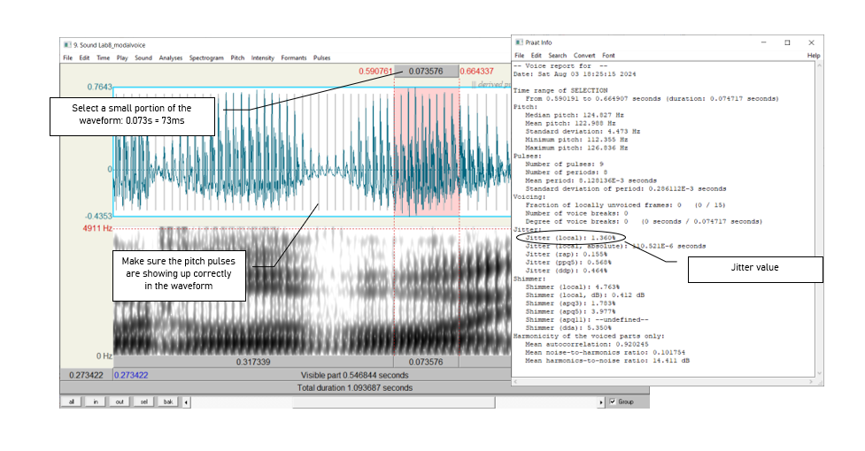
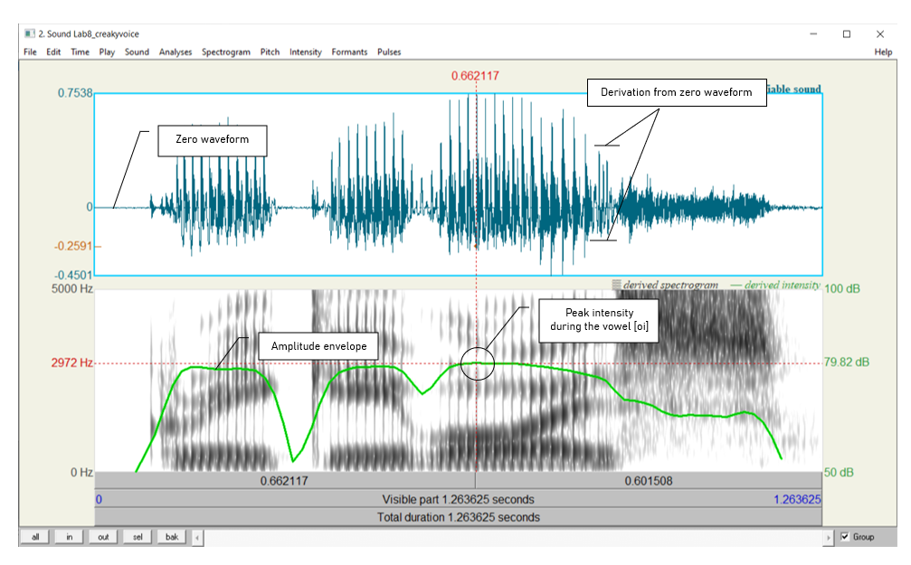
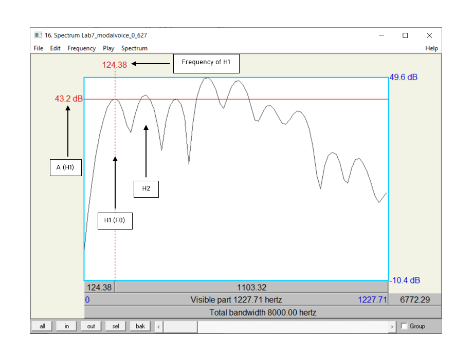

***

### __Goal of Lab 7:__
<h4> In this lab we are going to explore the acoustic correlates of the three main phonation types used across languages: _modal voicing_, _creaky voicing_, and _breathy voicing_. </h4>

***

#### __RECORDING__
Go to eClass and download the zip file "Lab7_SoundFiles", containing the files:

| _File name_                 |
|:---------------------------:|
|Lab7_Breathy_voice.wav       |
|Lab7_Modal_voice.wav         |
|Lab7_Creaky_voice.wav        |

Once these files have been downloaded, open them in Praat and fill in the cells of Table 7.1 on the lab report to compare voicing types in terms of different parameters. Follow the instructions below for taking the appropriate measurements.

 

> __TIP:__  
Since the word "voice" occurs in all three recordings, this is a good word to use for comparing across phonation types. Unless otherwise noted, measurements should be taken using ~30ms selections around the transition point between [o] and [i] in [oi] of voice, i.e. where the formants start spreading out. Here are approximate transition points in each file: 
>
* Modal voicing: 0.640s (see Figure 8.1)
* Creaky voicing: 0.703s
* Breathy voicing: 0.654s

 

>__TIP:__  
Keep in mind that what matters in comparing measurements are _relative_ values rather than _absolute_ values. For example, in measuring jitter, what matters is which phonation type has the most jitter, not what the exact measurement is.

***

#### __INSTRUCTIONS__
##### __A. FUNDAMENTAL FREQUENCY (F0)__

Fundamental frequency can be a good indication of phonation type. Note down F0 averaged over about 30ms around the measurement point of the three phonation types in Table 7.1 (if you can’t remember how to do this, see LAB 3).

 

>__TIP:__  
When you select a range in the view window, the values of F0, amplitude etc. at the right of the view window will report averages calculated over the selected region – note that this does not work for formants (displayed at the left), however.

 

 

##### __B. PERIODICITY__

There are two things to consider here:

a. How regularly the pitch pulses occur = degree of periodicity in the waveform
b. How many higher-frequency components there are in the waveform = spectral noise

  + The degree of periodicity can be quantified by measuring the __jitter__: the variation in the duration of successive F0 cycles (see Figure 7.2). Follow the instructions below and note down your jitter measurements.
  

 __high jitter value = high degree of aperiodicity in the glottal source__ 

 

>__TIP:__  
You will not be able to get a jitter value unless the pitch pulses are showing up correctly in the waveform (the vertical lines on the waveform, see Figure 7.2). If at the suggested point of measurement (see above), there are no pitch pulses, measure jitter at some other point where you do see the pitch pulses.

 

 

* Measure jitter value:
  + Pulses > Show pulses
  + Select a small portion (using a slightly larger value for this measurement, e.g. 70- 80ms, can increase reliability) of the waveform around the measurement point OR where you see pitch pulses clearly.
  + Pulses > Voice report
  + In the report window, get value for __Jitter (local)__, and note this down in Table 7.1

 

>__TIP:__  
If you notice that there are no pitch pulses on the waveform, you might need to reset the 'Pitch' settings! To do this, go to Pitch and click the "Standards' button. This will reset any previous settings and will show the pitch pulses on the waveform.

  

Also on the waveform you can see how much spectral noise there is in the signal by how complex the waveform looks (see Figure 7.3).

 __lots of little jagged peaks = lots of spectral noise in the higher frequencies__ 

 

Zoom in on the waveform until you can clearly see a few cycles (Figure 7.3). Note down in Table 7.1 your judgment on how much noise you observe.

 

 

##### __C. ACOUSTIC INTENSITY__

The three phonation types also differ in intensity. There are two ways to think about intensity differences, introduced below.

* Acoustic intensity can be ‘eyeballed’ by viewing the waveform or spectrogram directly. Note down the relative darkness on spectrogram and the relative size of deviations from zero waveform for different phonation types in Table 7.1.

 

 __relative darkness = loudness (spectrogram)__ 

 __relative size of deviations from zero waveform = loudness (waveform)__ 

 

* Amplitude can also be quantified by viewing the amplitude envelope (green contour) on the spectrogram display (see Figure 7.4). Note down in Table 7.1 the green amplitude value (in dB) on the right of the screen for different phonation types.

  + __Intensity > Show intensity__
  + Find the __peak__ intensity )(_highest_ point on green amplitude contour) during the vowel __[oi]__
  + Click on the amplitude contour at this point
  + Note the green amplitude value (in dB) on the right of the screen

 

 

##### __D. SPECTRAL TILT__

Spectral tilt is the degree to which intensity drops off as frequency increases. 

* Spectral tilt can be eyeballed by looking at a spectral slice of the waveform, which gives the component frequencies and their amplitudes (see Figure 7.5). Note down the overall slope of the spectrum for different phonation types in Table 7.1 (steep, gradual, etc.).

  + Select a portion (40 ms) of the waveform around the measurement point (given above)
  + __Spectrum > View spectral slice__
  + The overall slope of the spectrum (= how quickly the amplitude drops off in the higher frequencies) is an indication of spectral tilt:)

 

 __steep slope = highly negative spectral tilt = rapid drop off in A of higher frequencies__ 

 

 

* Spectral tilt can be quantified by comparing the amplitude of F0 to that of higher frequency harmonics, e.g. the second harmonic, the harmonic closest to the first formant, or the harmonic closest to the second formant. The easiest way to measure spectral tilt is by subtracting the amplitude of the second harmonic (H2) from the amplitude of F0 (H1) (see Figure 7.6). Fill in Table 7.1 with the spectral tilt value of the three phonation types.

  + Select the first few peaks (around 10 peaks) and <u> zoom in </u> so that you can see H1 and H2 clearly.
  + In the spectral slice, click on the peak of H1 and get its amplitude - the number on the <u> left </u> of the screen corresponds to the amplitude; the number at the top of the screen corresponds to the frequency.
  + Click on the peak of H2 and get its <u> amplitude </u>.
  + Calculate spectral tilt by this formula: __A(H1)-A(H2)__
  
 

>__TIP:__  
Measurements for these H1-H2 calculations are much more reliable when using a longer section of the sound being analysed. It is recommended that you select 50 - 60 ms of the diphthong to get better figures for this calculation.
>
H1 is the _first_ big-sized peak; H2 is the _second_ one. There may often be one or two lower amplitude peaks before H1, so make sure you’re measuring the right peaks. If you click on the first big peak (H1), the value at the top of the vertical red bar gives you its frequency. Make sure this frequency corresponds to F0 (as verified by some other measurement technique – see LAB 3). Also make sure that the frequency of H2 is approximately twice the frequency of H1 (see LAB 4 for the reasoning here).

 

 

##### __E. FORMANT FREQUENCY__

Non-modal phonation can affect the formant frequencies, particularly the first formant (F1). Note down F1 for each phonation type.

*	For this measurement, select about 30ms in the stable (middle) part of the __[o]__ portion of the __[oi]__ diphthong, _not_ the transition point between [o] and [i].
  + On the spectrogram, click in the centre (vertical) of the first formant (F1).
  + The number at the <u> left </u> of the screen, at the end of the red horizontal bar gives you the frequency (in Hz).

 

>__TIP:__  
You can use the formant tracings if they help: __Formant > Show formants__.

 

##### __F. DURATION OF [oi]__

Duration can also be a good indication of phonation type (see Figure 7.7). Note down the duration of [oi] for each phonation type.

*	Measure the duration for the whole diphthong __[oi]__ by selecting the vowel
* You can read the duration from the panel above the selected segment

 

>__TIP:__  
To isolate [oi], you can use visual information (look for the change in the shape of the spectrogram/waveform). You can also use your ears.

 

 

##### __G.OVERALL CLARITY OF THE SPECTROGRAM__

Finally, phonation types differ in the overall clarity of the spectrogram – this has to do with the amount of noise in the signal, etc. Note down your impressions of overall clarity of the spectrogram of each phonation type.

 

***

***
 

 <h4> __LAB 7 REPORT__ </h4> 
 

 _Table 7.1 Comparing acoustic correlates of different phonation types (enter values where measurements were taken; otherwise enter general comments)_ 
 
|                              |                    |  _Modal voicing_  |  _Creaky voicing_  |  _Breathy voicing_  |
|:-----------------------------|:-------------------|:-----------------:|:------------------:|:-------------------:|
| 1. Fundamental frequency     |                    |                   |                    |                     |
|Periodicity                   | 2. Jitter value    |                   |                    |                     |
|                              | 3. Spectral noise  |                   |                    |                     |
|Intensity                     | 4. Relative darkness on spectrogram / relative deviation on waveform |   |    |   |
|                              | 5. Amplitude value (dB)|               |                    |                     |
|Spectral tilt                 | 6. Overall slope of the spectrum       |                    |                   | |
|                              | 7. A(H1) - A(H2)   |                   |                    |                     |
| 8. Formant frequency (F1 value) |                 |                   |                    |                     |
| 9. Duration of [oi] (ms)        |                 |                   |                    |                     |
| 10. Overall clarity of spectrogram |              |                   |                    |                     |

 

__Q1:__ Based on your observations, what measurements/cues seem to be the most and least reliable for distinguishing phonation types?

 

 <h4> __REFERENCES__ </h4> 
 

__Q2:__ Provide a reference and very brief summary of one academic paper that uses the methods covered in this lab.

***

 Disclaimer: The original lab materials on which this lab is based was put together in 2015 (updated 2019) by Sonya Bird, Qian Wang, Sky Onosson, and Allison Benner for the LING 380 Acoustic Phonetics course at the University of Victoria. Their materials are released under a Creative Commons license (CC BY-NC-SA 4.0) which allows for non-commercial use as well as copying and distribution and the creation of derivative works for non-commercial purposes. Thomas Kettig (with assistance from Taylor Potter) has modified these materials as needed for the York University LING 4220 Acoustic Phonetics course.

 

