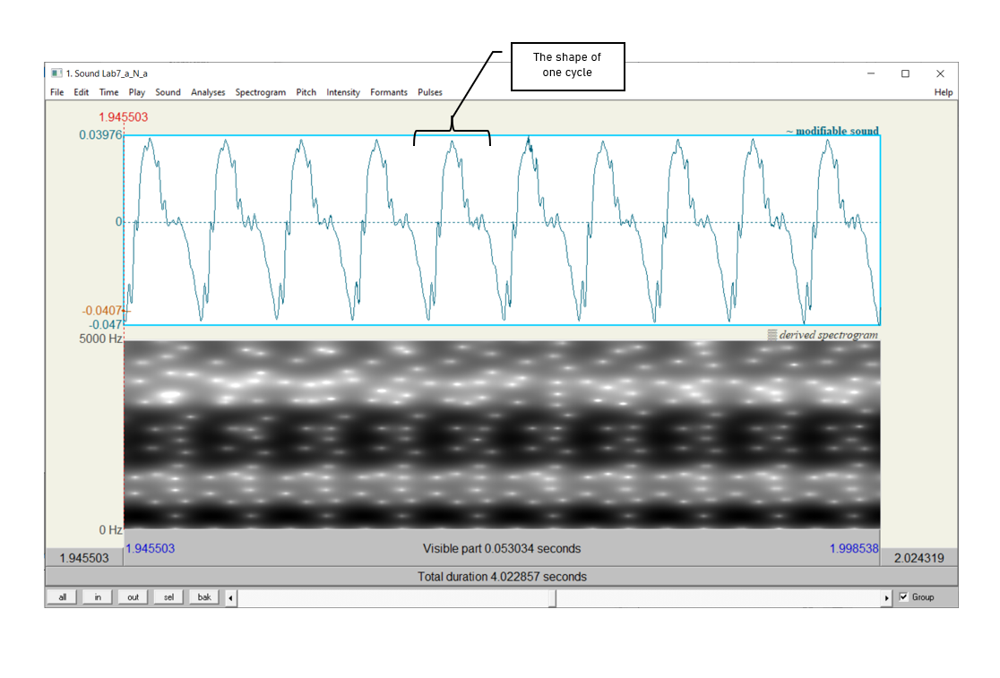
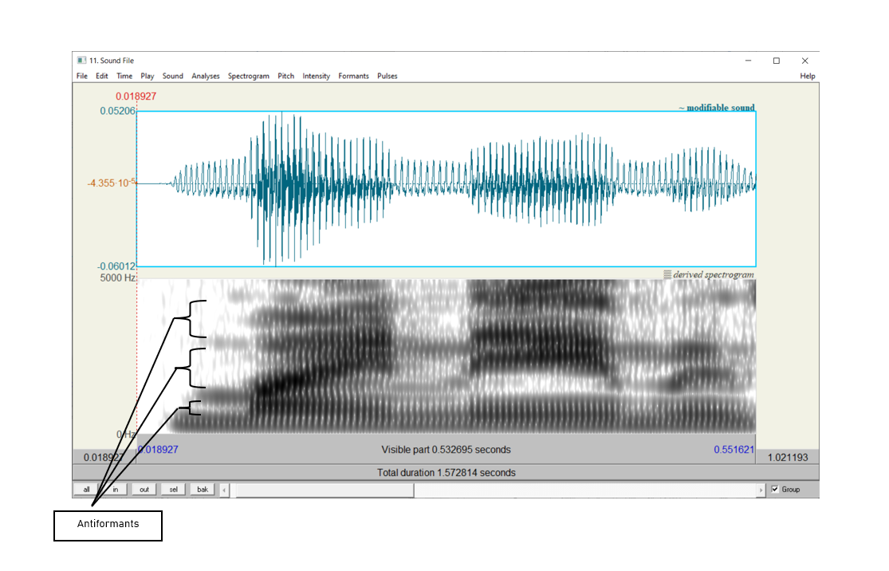

***

### __Goal of Lab 7:__
<h4> In this lab, we are going to explore the acoustic correlates of another class of sonorants,
__nasals__ - [m n ŋ]. Like other sonorants, nasals are:  
*	similar to vowels in that they have formants
* different from vowels in that they are generally lower amplitude (and behave as consonants phonologically), and have a more complex spectral composition. </h4>

***

#### __RECORDING__
Generate the following sound file, containing the sound sequences listed.

| _File name_          | _sounds to record_ |
|:--------------------:|:------------------:|
|Lab8_Nasals.wav       |ama, ana, aŋa       |

In this lab, you should focus on what is common between <u> all three</u> nasals.

***

#### __INSTRUCTIONS__

 

1. Open the file __Lab8_Nasals.wav__. Follow the instructions below to fill in Table 8.1 on the acoustic correlates of different nasals.

 

<u><h5> A. Nasal F1 Values </u></h5>

If you can't remember how to measure formants, refer back to Lab 4.

* In Table 8.1, note down F1 for each nasal, as measured in the middle of the nasal.

 

<u><h5> B. Spectral slice </u></h5>

* Create spectral slices for each nasal and for one example of [a] (see Lab 5), from a 30ms selection for each sound. Take a screenshot of each spectral slice and paste them into your lab report document. Be sure to give the spectral slice an appropriate title.

 

<u><h5> C. Waveform </u></h5>

* Nasals have very distinctive waveforms. To see this, zoom in on 10 or so cycles of each nasal. Take a screenshot of the visible waveform and paste it into your lab report. Be sure to give the waveform an appropriate title.

 

<u><h5> D. Antiformants </u></h5>

Antiformants are the _opposite_ of formants – they are bands of frequencies that are actively damped rather than amplified (we’ll talk about this in class). They show up on the spectrogram as bands of white, i.e. bands of ‘silence’ at particular frequencies (see Figure 8.2). They can be hard to see, so don’t worry if their measurement seems hard. For finding antiformants, you may find it easier to get rid of the formant tracking.

* Again, in Table 8.1, note down the frequency of A1 (Antiformant 1), A2, and A3 for each nasal, as measured in the middle of the nasal.

 

***

***
 

 <h4> __LAB 8 REPORT - NASALS__ </h4> 
 

 _Table 8.1 Acoustic correlates of nasals_ 

|     Correlates     |     [m]     |     [n]     |     [ŋ]     |
|:------------------:|:------------|:------------|:------------|
| A. F1              |             |             |             |
| D. Antiformants    | A1:         | A1:         | A1:         |
|                    | A2:         | A2:         | A2:         |
|                    | A3:         | A3:         | A3:         |

 

__Q1:__ Look at your measurements of F1 for the three nasals. Do these measurements vary across different places of articulation? Can you think of an explanation for this result?

__Q2:__ Compare the spectral slices of the nasals vs. [a] – do you see any overall differences between the nasals on the one hand and [a] on the other? (Relate this to your answer to Q1 and Q3.)

__Q3:__ How does the shape of the waveform of the nasals differ from that of [a]? What causes this pattern? (Relate this to Q1 and Q2 above.)

__Q4:__ Are there any systematic patterns across nasals: is there one antiformant with a similar frequency for all places of articulation?

 

 <h4> __REFERENCES__ </h4> 
 

__Q5:__ Provide a reference and very brief summary of one academic paper that uses the methods covered in this lab.

***

 Disclaimer: The original lab materials on which this lab is based was put together in 2015 (updated 2019) by Sonya Bird, Qian Wang, Sky Onosson, and Allison Benner for the LING 380 Acoustic Phonetics course at the University of Victoria. Their materials are released under a Creative Commons license (CC BY-NC-SA 4.0) which allows for non-commercial use as well as copying and distribution and the creation of derivative works for non-commercial purposes. Thomas Kettig (with assistance from Taylor Potter) has modified these materials as needed for the York University LING 4220 Acoustic Phonetics course.

 

